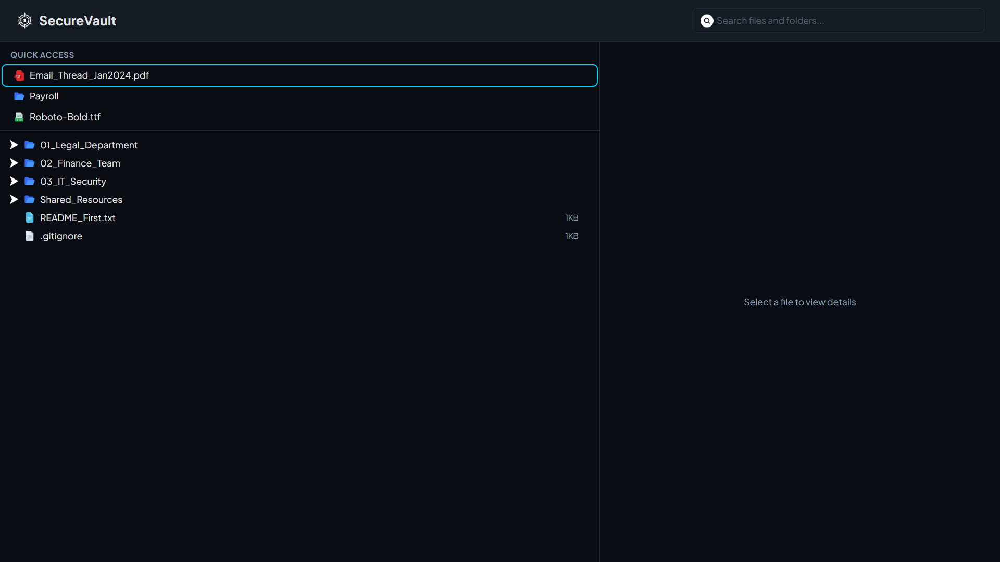
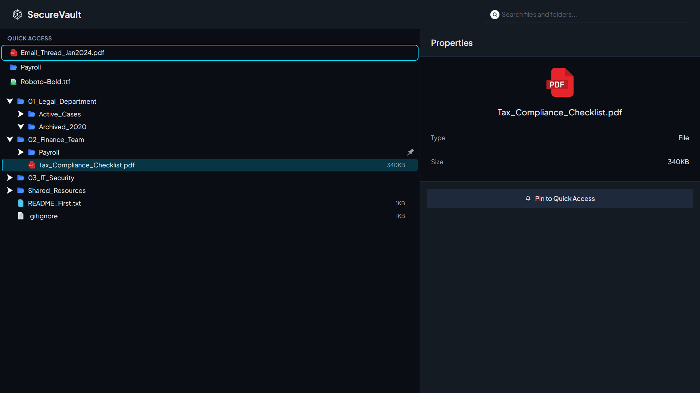
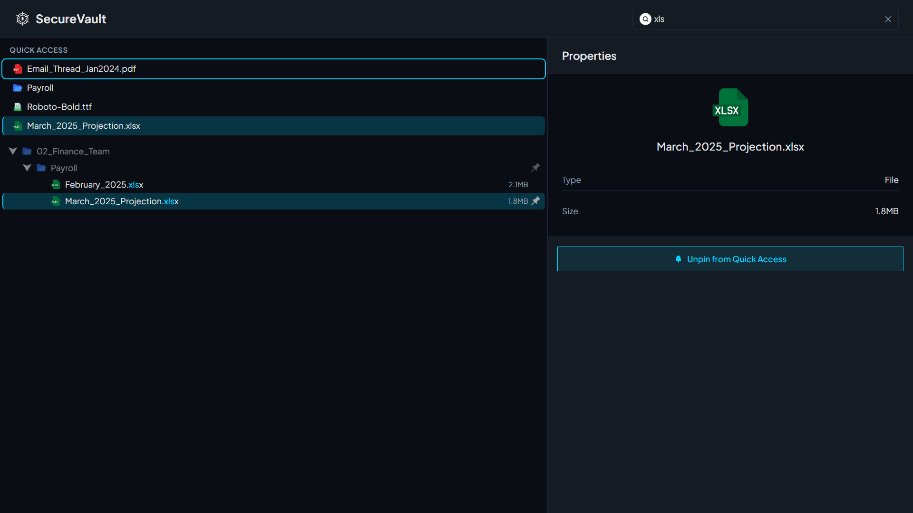

<h1> SecureVault Dashboard</h1>

A high-performance file explorer interface built for law firms and financial institutions managing complex, deeply-nested file hierarchies. Built with React 19, TypeScript, Tailwind CSS v4, and Vite — zero component libraries.

**🌐 Live Demo:** [secure-vault-dashboard.vercel.app](https://secure-vault-dashboard.vercel.app/)
**🎨 Design File:** [Figma — SecureVault](https://www.figma.com/design/ceR78WiNCyKB5J1OaYvOIx/SecureVault?node-id=0-1&t=qYstR6weXKH91eMJ-1)

### Screenshots







---

## ✨ Features

### Core Functionality

- **Recursive Tree Navigation** — Renders unlimited nesting depth with expand/collapse on click
- **File Inspection Panel** — Instant metadata display (name, type, size) with visual selection states
- **Full Keyboard Accessibility** — Navigate (↑↓), expand/collapse (→←), and select (Enter) without touching the mouse
- **Search & Filter** — Case-insensitive search with match highlighting and automatic parent folder expansion
- **Quick Access Pinning** — Pin frequently-accessed items for one-click retrieval, persisted in localStorage

---

## 🚀 Quick Start

### Prerequisites

- Node.js 18+ and pnpm

### Installation

```bash
git clone https://github.com/Esfokom/SecureVault-Dashboard.git
cd SecureVault-Dashboard
pnpm install
pnpm run dev
```

The application opens at `http://localhost:5173`

### Build for Production

```bash
pnpm run build
pnpm run preview
```

---

## 🏗️ Architecture & Design Decisions

### Tech Stack

| Layer     | Choice                      | Rationale                                                          |
| --------- | --------------------------- | ------------------------------------------------------------------ |
| Framework | **React 19** + TypeScript   | Type safety, hooks-first architecture                              |
| Build     | **Vite 7**                  | Sub-second HMR, optimized production builds                        |
| Styling   | **Tailwind CSS v4**         | `@theme` directive for custom design tokens, no config file needed |
| UI        | **Zero libraries**          | Every component hand-built for full control                        |
| Data      | **Fetch from `/data.json`** | Simulates API response; easily swappable                           |

### Data Structure: Nested → Flattened Map

The nested JSON tree is transformed on load into a `Map<string, TreeItemWithMeta>` for O(1) lookups:

```typescript
// Input (nested)
{ id: "root_1", children: [{ id: "child_1", children: [...] }] }

// Output (flattened)
Map {
  'root_1' → { ...data, parentId: null, depth: 0, hasChildren: true },
  'child_1' → { ...data, parentId: 'root_1', depth: 1, hasChildren: true }
}
```

**Why this matters:**

- `itemsMap.get(id)` is **O(1)** — no recursive search needed to find any item
- `parentId` and `depth` are precomputed — no recalculation during renders
- `getParentChain()` walks `parentId` pointers for instant ancestor resolution

### State Management: Custom Hook, No Library

All tree state lives in a single `useFileTree` hook. No Redux, Zustand, or Context needed at this scale:

```typescript
// useFileTree.ts manages:
expandedFolders: Set<string>; // O(1) has/add/delete
selectedItemId: string | null; // Current selection
pinnedItems: Set<string>; // Persisted to localStorage
searchQuery: string; // Filter state
```

**Why `Set<string>` over arrays?** `Set.has()` is O(1) vs `Array.includes()` O(n) — critical when checking expansion state for every visible node on each render.

### Recursive Component Pattern

`TreeNode` renders itself for children — depth is implicit through recursion:

```tsx
const TreeNode = memo(({ item, itemsMap, expandedFolders }) => (
  <div>
    <Row style={{ paddingLeft: `${item.depth * 24}px` }}>
      {item.name}
    </Row>
    {isExpanded && children.map(child => (
      <TreeNode key={child.id} item={child} ... />  {/* recursion */}
    ))}
  </div>
))
```

`React.memo` prevents re-rendering unchanged subtrees — only the toggled folder and its descendants re-render.

### Keyboard Navigation Algorithm

`computeVisibleItems()` walks the tree in visual order, skipping collapsed subtrees:

```typescript
// Produces: ['root_1', 'child_1', 'grandchild_1', 'root_2', ...]
// Only expanded folders' children are included
```

A `focusIndex` integer tracks position in this array. Arrow keys increment/decrement with wrapping. This is O(1) per keypress. When items change (folder collapsed), the index is clamped to prevent out-of-bounds.

### Search Algorithm

`filterTreeByQuery()` returns two sets:

- **`matchingIds`** — items whose names contain the query (highlighted in cyan)
- **`visibleIds`** — `matchingIds` ∪ all their ancestors (so the path is walkable)

Pre-search expansion state is saved in a `useRef` and restored when the search is cleared.

### Pinning with localStorage

```typescript
// Load on mount (with graceful degradation)
const saved = localStorage.getItem("securevault-pinned-items");

// Save on every toggle
localStorage.setItem(
  "securevault-pinned-items",
  JSON.stringify([...pinnedItems]),
);
```

Stale IDs (items deleted from data) are filtered out on load. `try/catch` handles disabled/full localStorage.

When a pinned item is clicked in Quick Access, `selectAndRevealItem()` expands all parent folders via `getParentChain()` so the item is revealed in the main tree.

---

## 🎨 Design System

### Typography

**Font Family:** [Plus Jakarta Sans](https://fonts.google.com/specimen/Plus+Jakarta+Sans) — loaded from Google Fonts

| Role  | Size | Weight          | Usage                                       |
| ----- | ---- | --------------- | ------------------------------------------- |
| H1    | 24px | Bold (700)      | Page title, header                          |
| H2    | 18px | Bold (700)      | Section headings (Properties, Quick Access) |
| H3    | 16px | Semi-bold (600) | Sub-section labels                          |
| Body  | 14px | Regular (400)   | Tree item names, descriptions               |
| Small | 12px | Regular (400)   | File sizes, metadata, labels                |

**Weight Variations:**

- **Regular (400)** — Body text, tree items, metadata
- **Medium (500)** — Search match highlights, buttons
- **Bold (700)** — Headings, branding

### Color Palette (Dark Mode)

| Token                  | Hex       | Usage                              |
| ---------------------- | --------- | ---------------------------------- |
| `vault-bg-primary`     | `#0a0e14` | Main background                    |
| `vault-bg-secondary`   | `#151b23` | Panels, cards, header              |
| `vault-bg-hover`       | `#1e293b` | Hover states, borders              |
| `vault-accent`         | `#00d4ff` | Focus rings, selection, highlights |
| `vault-text-primary`   | `#e4e4e7` | Body text                          |
| `vault-text-secondary` | `#94a3b8` | Labels, metadata                   |

### Component States

| State              | Visual                                     |
| ------------------ | ------------------------------------------ |
| Default            | Base styling                               |
| Hover              | `bg-vault-bg-hover` background             |
| Selected           | `bg-vault-accent/20` + left border accent  |
| Focused (keyboard) | `outline-2 outline-vault-accent` ring      |
| Search match       | Name substring highlighted in accent color |
| Non-match ancestor | 50% opacity                                |

---

## ⭐ Wildcard Feature: Quick Access Pinning

### Problem

Law firms work with 5–10 active cases out of years of archived files. Navigating 4–5 folder levels to reach the same discovery document dozens of times per day wastes time and breaks focus.

### Solution

A persistent "Quick Access" section at the top of the sidebar. Users pin files or folders via:

- **Hover pin icon** in the tree (appears on mouseover)
- **"Pin to Quick Access" button** in the Properties Panel

Clicking a pinned item in Quick Access auto-expands its parent folders in the main tree, providing instant navigation to deeply nested files.

### Business Value

- **4–5 clicks → 1 click** for frequently accessed items
- **Zero learning curve** — familiar "favorites" pattern from native file systems
- **Session persistence** — pins survive page refreshes via localStorage

---

## 📁 Project Structure

```
src/
├── components/
│   ├── FileExplorer/       # Main layout — SearchBar + QuickAccess + TreeView + PropertiesPanel
│   ├── TreeView/           # Maps root items to TreeNode
│   ├── TreeNode/           # Recursive component — the core rendering algorithm
│   ├── PropertiesPanel/    # Selected item metadata + pin/unpin button
│   ├── QuickAccess/        # Pinned items shortcut list
│   └── SearchBar/          # Search input with clear button
├── hooks/
│   ├── useFileTree.ts      # All tree state: expand, select, search, pin
│   └── useKeyboardNav.ts   # Arrow key + Enter handling, focus index
├── utils/
│   ├── dataTransform.ts    # transformTreeData (nest → Map), getIconPath
│   ├── treeUtils.ts        # getParentChain, filterTreeByQuery
│   └── keyboardNav.ts      # computeVisibleItems
├── types/
│   └── index.ts            # TreeItem, TreeItemWithMeta, FlatTreeData
└── App.tsx                 # Fetches data.json, renders header + FileExplorer
```

---

## 🎯 User Stories Implemented

| #   | Story                                                                      | Status |
| --- | -------------------------------------------------------------------------- | ------ |
| 1   | **Recursive Tree Navigation** — Expand/collapse folders, unlimited nesting | ✅     |
| 2   | **File Details & Inspection** — Selection state + Properties Panel         | ✅     |
| 3   | **Keyboard Accessibility** — ↑↓→← Enter with focus ring                    | ✅     |
| 4   | **Quick Access Pinning** — Pin/unpin, localStorage, auto-reveal            | ✅     |
| 5   | **Search & Filter** — Real-time filter, match highlighting, auto-expand    | ✅     |

---

## 🔧 Performance Considerations

1. **`React.memo`** on `TreeNode` — prevents re-rendering unchanged subtrees
2. **`Map<string, TreeItemWithMeta>`** — O(1) lookups vs O(n) recursive traversal
3. **`Set<string>`** for `expandedFolders`, `pinnedItems` — O(1) membership checks
4. **Lazy child rendering** — children only mount when parent is expanded
5. **Single `window` keydown listener** — not per-node, avoids listener proliferation
6. **`useMemo`** on data transform — `transformTreeData` runs once per data change
7. **`useCallback`** on all handlers — stable references prevent child re-renders

---

## 📄 License

MIT License

---

**Built with React 19 + TypeScript + Tailwind CSS v4 + Vite 7**
